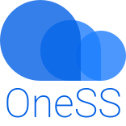

# OneSS

让你的 Onedrive 能像 OSS 一样使用 | Make your Onedrive work like OSS(Object Storage Service)

# 特性 | Features

- 免费! | Free !
- API Support
- 多用户支持 | Multi-user Support
- 多主题 | Multiple Themes
- 可以做图床，视频云 | Cloud Storage Services for Photos and Video[(demo)](https://mystatic.dzaaaaaa.com/OneSS.html)

# 开始 | Start

- 部署 | Deploy

  [中文](./doc/zh/deploy_zh.md) | en

- 使用 | How to use

  在自己 OneDrive 的根目录建立名为 OneSS 的文件夹 | Create a folder named OneSS in the root directory of your OneDrive

- 自定义设置 |

  [中文](./doc/zh/customSetting_zh.md) | en

# [API](./doc/api/api.md)

# 不会去做的功能 | Anti-features

- 单个文件夹内文件个数在 200 以上的支持 (会泄权，建议每个文件夹不要放大于 200 个文件

# Use Github Actions

- 使用 Github Actions 定时构建任务，如索引等
- 有助于提升活跃度[demo](./auto/README.md)

# Issues

- 欢迎提建议与意见
- 错误或者 Bug 之类的请详细描述，尽量有截图或者报错信息
- 莫名其妙的话会予以删除

# Motivation

- 目标是让 OneSS 更像 OSS 一样的使用！

- 情景假设 | Scenario Analysis

    - 个人博客需要插入图片，音频或者视频，但是无法负担昂贵的存储费用，或者一些云存储服务并不理想。需要一个方便上传，调用的空间。

    - 一个作者，把完成的合法，优秀的作品传到适当网站，但因为莫须有的原因(平台间竞争，原作者被盗窃者举报......)被审核删除，那么就需要一个更好地分享位置，一个不用看别人脸色的地方。

- 是的，当我们都可以自己储存并共享自己的文件的时候，我们可以建立我们自己的平台。

# Licence

[GPL-3.0](LICENSE) © [Tualin14](https://github.com/Tualin14)

# 个人用快捷链接

- [oness](https://oness.dzaaaaaa.com/)
- [oness-dev](https://oness-dev.dzaaaaaa.com/)
- [在 Microsoft Graph 中使用文件](https://docs.microsoft.com/zh-cn/graph/api/resources/onedrive?view=graph-rest-1.0)
- [SWR](https://swr.vercel.app/zh-CN/docs/getting-started)
